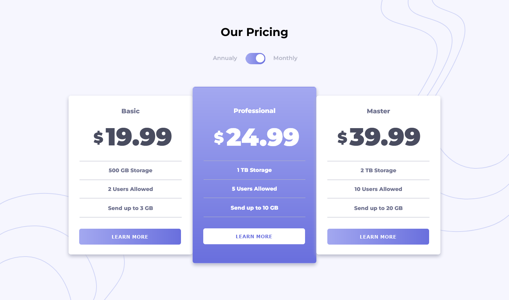
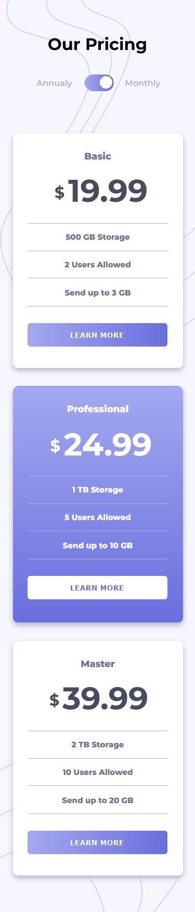

# Frontend Mentor - Pricing component with toggle solution

This is a solution to the [Pricing component with toggle challenge on Frontend Mentor](https://www.frontendmentor.io/challenges/pricing-component-with-toggle-8vPwRMIC). Frontend Mentor challenges help you improve your coding skills by building realistic projects. 

## Table of contents

- [Overview](#overview)
  - [The challenge](#the-challenge)
  - [Screenshots](#screenshots)
  - [Links](#links)
- [My process](#my-process)
  - [Built with](#built-with) 
- [Author](#author)

## Overview

### The challenge

Users should be able to:

- View the optimal layout for the component depending on their device's screen size
- Control the toggle with both their mouse/trackpad and their keyboard
- **Bonus**: Complete the challenge with just HTML and CSS

### Screenshots

#### Desktop Design

#### Mobile Design

### Links

- Solution URL: [GitHub](https://github.com/Aimal-125/price-component.git)
- Live Site URL: [GitHub Pages](https://aimal-125.github.io/price-component/)

## My process

### Built with

- Semantic HTML5 markup
- CSS custom properties
- Flexbox
- Mobile-first workflow

## Author

- Frontend Mentor - [@Aimal-125](https://www.frontendmentor.io/profile/Aimal-125)
- Twitter - [@aimal4910](https://www.twitter.com/aimal4910)
- LinkedIn - [@aimalkhan125](https://www.linkedin.com/in/aimalkhan125)